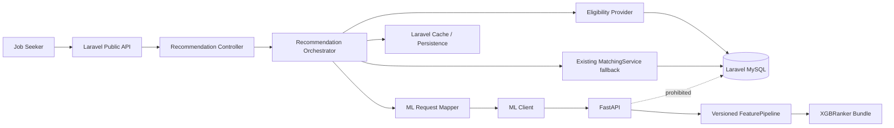
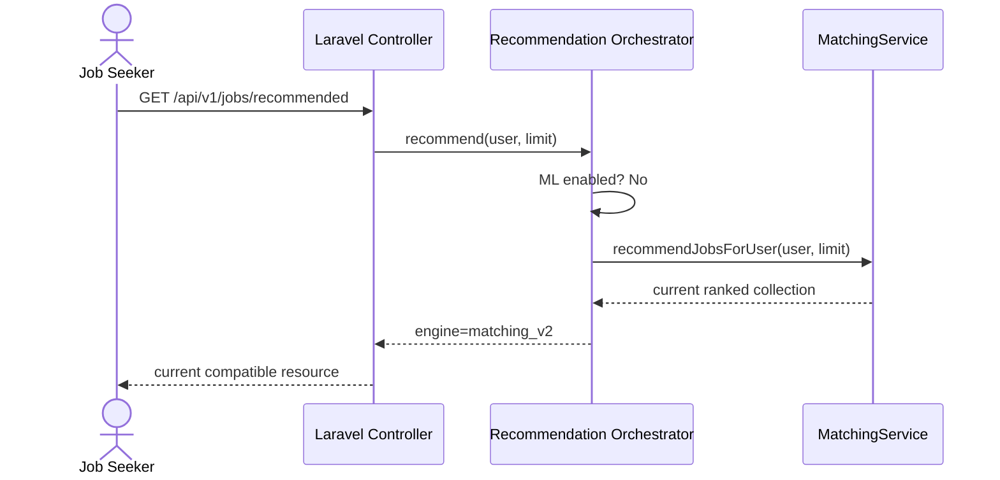
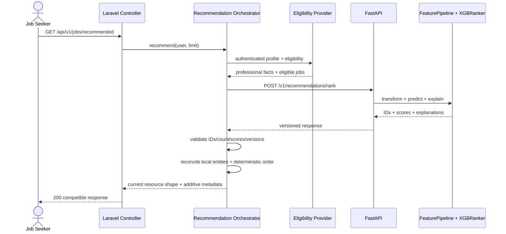
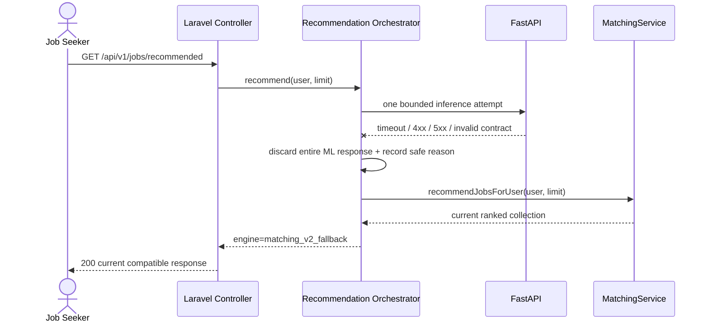
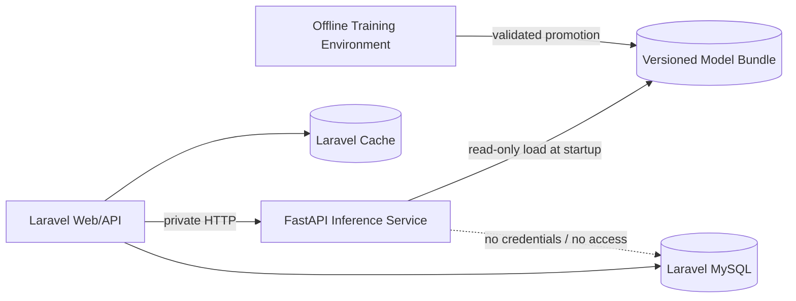

# مواصفة معمارية لنظام ML Job Recommendation

## 1. Document Metadata

| الحقل | القيمة |
|---|---|
| Document version | `1.0` |
| Status | `Proposed` |
| Project | `Smart Recruitment Platform` |
| Feature | `Job Seeker → Job Recommendation` |
| Source revision | `6cd51f733d5197e0c3f6b7dfb3711c2860ffef71` |
| Existing matching version | `2.0` |
| Target model family | `XGBRanker` |
| Target objective | `rank:ndcg` |
| Primary metric | `NDCG@5` |
| Authoring phase | `Phase 2 — Architecture Specification` |
| Last updated | `2026-07-23` |
| Dataset / model state | لا توجد Dataset مولّدة ولا Labels ولا Model مدرّب أو Model artifacts حتى تاريخ هذه الوثيقة. |

هذه الوثيقة مواصفة مستقبلية وليست وصفًا لخدمة ML عاملة. كل مكوّن Python أو FastAPI أو XGBoost مذكور بوصفه Target Architecture فقط.

## 2. Context and Current State

الحالة المثبتة عند `source_revision` هي:

- الـpublic endpoint الحالي هو `GET /api/v1/jobs/recommended` في `routes/api/v1.php`، ويعمل خلف مصادقة Sanctum وقيود المسار الحالية.
- `JobPostingController::recommended()` يستقبل `RecommendedJobsRequest` ثم يستدعي مباشرة `MatchingService::recommendJobsForUser()` ويعيد `RecommendedJobResource`.
- `MatchingService::recommendJobsForUser()` يتحقق من أن المستخدم `Job Seeker` ومن وجود `JobSeekerProfile`.
- استعلام eligibility الحالي يجلب `status = open`، ويتطلب `company.approval_status = approved`، ويستبعد أي وظيفة لها `JobApplication` سابقة للـprofile نفسه بغض النظر عن حالة الطلب.
- الاستعلام الحالي لا يستبعد `application_deadline` المنتهي؛ إضافة هذا الشرط هي parity correction مستهدفة ومُوثقة هنا فقط، وليست تعديلًا منفذًا في Phase 2.
- Matching `2.0` يحسب مجموعًا من `required_skills = 45`، و`nice_to_have_skills = 10`، و`experience = 20`، و`education = 10`، و`text_similarity = 15`. تُقيد النتيجة إلى `[0, 100]` وتُقرب إلى منزلتين.
- `RecommendedJobResource` يعرض بيانات الوظيفة والحقول الحالية، ومنها `score` و`matching_score_version` و`breakdown` وحقول المهارات و`reasons`.
- قيمة fallback المعتمدة هي ناتج `MatchingService::recommendJobsForUser()` نفسه، وليست قيمة ثابتة أو قائمة فارغة.
- TF-IDF الحالي dynamic: corpus لكل request يتكون من نص profile كـanchor وكل الوظائف المؤهلة في ذلك الطلب؛ لذلك تتغير IDF وقد تتغير `text_similarity` عند تغير مجموعة الوظائف حتى لو لم تتغير وظيفة بعينها أو profile.
- الترتيب الحالي deterministic بحسب `score DESC` ثم `published_at DESC` ثم `job.id ASC`.
- اختبارات Phase 1 عند نفس revision سجلت: مجموعة `Matching` نجحت بـ`32` tests و`170` assertions؛ والمجموعة الكاملة نجحت بـ`534` tests و`3994` assertions مع `1` skipped وبدون failures.

`MatchingService::rankCandidatesForJob()` يشترك حاليًا في scorer وبعض بناء النص، ويخدم `GET /api/v1/jobs/{jobPosting}/candidates/ranked`. لكنه خارج نطاق نموذج ML الجديد، ولن يوجّه إلى FastAPI. أي توسعة مستقبلية لـCandidate Ranking تحتاج مشروعًا أو ADR مستقلًا.

## 3. Goals

- إضافة Learning-to-Rank حقيقي ومدرّب باستخدام `XGBRanker` بدل الادعاء بأن heuristic الحالي Model.
- إبقاء `MatchingService` الحالي صالحًا وغير معاد الكتابة بوصفه baseline وfallback تشغيليًا.
- تنفيذ fallback تلقائي وآمن عند تعطيل ML أو فشل runtime/service/contract.
- توفير explainability قابلة للتدقيق، ثم أسباب موجزة وآمنة للمستخدم.
- ضمان reproducibility للبيانات والتقسيم والتدريب والتقييم.
- versioning مترابط للـDataset والـFeature Schema والـModel والـsource revision.
- الالتزام بـdata minimization وعدم إرسال بيانات حساسة أو تشغيلية غير لازمة إلى Python.
- نشر FastAPI مستقلًا مع عزل قاعدة بيانات Laravel.
- الحفاظ على توافق `GET /api/v1/jobs/recommended` والحقول العامة الحالية.

## 4. Non-Goals

- حذف `MatchingService` أو إعادة كتابته.
- تعديل formula أو component weights أو score semantics أو rounding أو clamping الخاصة بـMatching `2.0` ضمن مبادرة ML Job Recommendation.
- تحويل `MatchingService::rankCandidatesForJob()` أو Candidate Ranking إلى ML.
- قبول أو رفض Applicant أو تغيير أي `JobApplication` status.
- بناء AI Interview Bot.
- face analysis أو voice analysis.
- إعطاء Python وصولًا إلى MySQL أو Eloquent أو قاعدة بيانات Laravel.
- online training داخل recommendation request.
- استخدام بيانات Production غير مجهولة في إنشاء Dataset.
- بناء frontend أو تغيير تجربة الواجهة.
- تنفيذ FastAPI أو Dataset أو Labels أو Feature Pipeline أو training أو Laravel integration أو migrations أو tests أو Docker في Phase 2.

## 5. Requirements Traceability

| المرجع | Requirement | Architecture decision | Future phase | Verification method |
|---|---|---|---|---|
| `AI-04` | Job Seeker يحصل على وظائف مرتبة من Profile ووظائف مؤهلة | `ADR-ML-001` وLaravel Eligibility Provider و`XGBRanker` | 13–18 | Contract وend-to-end tests |
| `AI-04` | match score وأسباب مختصرة | calibrated `display_score` وreason codes المشتقة من contributions | 10–12 | Evaluation وexplainability/API tests |
| `UC-SYS-08` | Trigger عند فتح Recommended Jobs | إبقاء `GET /api/v1/jobs/recommended` كنقطة الدخول | 13–14 | Laravel feature tests |
| `UC-SYS-08` | الحفاظ على الخدمة الحالية | `MatchingService` baseline/fallback ثابت | 7 و14 | Baseline parity وfallback tests |
| AI assistant-only | لا قرار قبول/رفض ولا تغيير Application | FastAPI يعيد IDs/scores/explanations فقط | 3 و12–14 | Schema denylist وside-effect tests |
| Company approval | وظائف شركة `approved` فقط | Laravel وحده يطبق eligibility قبل payload | 14 | Eligibility parity tests |
| Job status | `status = open` فقط | Laravel وحده يرسل eligible jobs | 14 | Closed/draft exclusion tests |
| Application deadline | `null` أو غير منتهٍ | parity correction في Laravel target query؛ غير منفذة في Phase 2 | 14 | Boundary-time feature tests |
| Prior application | استبعاد أي تقديم سابق بغض النظر عن status | `whereDoesntHave` semantic يبقى في Laravel | 14 | Tests لكل statuses |
| Job Seeker authorization | مستخدم active ومصادق ودوره Job Seeker وله profile | Laravel authentication/authorization precondition | 14 | Auth/role/profile tests |
| Explainability | أسباب موجزة وغير مضللة | TreeSHAP/SHAP → bounded safe reason codes | 11–12 | Contribution/reason safety tests |
| Privacy | لا demographic/sensitive/unnecessary fields | allowlist/denylist وعزل DB وعدم تمرير auth token | 3 و13–15 | Serialized payload snapshot tests |
| API compatibility | عدم كسر endpoint أو حذف fields | `RecommendedJobResource` يبقى boundary؛ metadata additive فقط | 13–14 | Contract regression tests |
| Fallback | فشل ML لا يفشل endpoint إن عمل النظام الحالي | Orchestrator يستدعي ML أو `MatchingService` بلا recursion | 14 | Failure injection matrix |

## 6. Architecture Decisions

### ADR-ML-001 — ML لـJob Recommendation فقط

**Context:** يوجد مساران يشاركان scorer الحالي.  
**Decision:** يطبق ML على `Job Seeker → Job Recommendation` فقط.  
**Rationale:** حالات الاستخدام والـlabels والإنصاف في Candidate Ranking مختلفة جوهريًا.  
**Consequences:** يبقى `GET /api/v1/jobs/{jobPosting}/candidates/ranked` و`MatchingService::rankCandidatesForJob()` كما هما.

### ADR-ML-002 — Laravel هو مصدر eligibility الوحيد

**Context:** Laravel يملك users وcompanies وjobs وapplications.  
**Decision:** Laravel يحسم القائمة المؤهلة كاملة قبل استدعاء Python.  
**Rationale:** يمنع ازدواج business rules وتجاوز authorization.  
**Consequences:** Python لا تبحث عن jobs ولا تضيف IDs إلى القائمة.

### ADR-ML-003 — Python بلا Database access

**Context:** منح DB credentials يوسع سطح الهجوم ويكرر domain logic.  
**Decision:** FastAPI لا تتصل بـMySQL ولا تملك credentials.  
**Rationale:** فصل واضح، data minimization، ونشر مستقل.  
**Consequences:** كل request يحمل facts المهنية اللازمة فقط.

### ADR-ML-004 — `MatchingService` baseline وfallback ثابت

**Context:** المحرك الحالي عامل ومختبر.  
**Decision:** يُعامل `MatchingService` بإصداره `2.0` كـFrozen Baseline: لا يُحذف، ولا يُعاد كتابته، ولا يُعاد توجيهه داخليًا إلى ML، ولا تُعدّل معادلته ضمن مبادرة ML Job Recommendation. تبقى component weights الحالية حرفيًا: `required_skills = 45`، و`nice_to_have_skills = 10`، و`experience = 20`، و`education = 10`، و`text_similarity = 15`. كما لا تتغير score semantics أو rounding إلى منزلتين أو clamping إلى `[0,100]` الخاصة بـMatching `2.0`.  
**Rationale:** rollback تشغيلي فوري ومقارنة baseline حقيقية.  
**Consequences:** يبقى ناتج Matching `2.0` هو baseline وfallback المرجعي، ويجب الحفاظ على اختبارات Matching الحالية. أي تغيير مستقل مستقبلًا في formula أو weights أو score semantics أو rounding أو clamping يحتاج scope مستقلًا وADR مستقلًا واختبارات مستقلة، ولا يُعد جزءًا من مبادرة `XGBRanker` الحالية.

### ADR-ML-005 — Orchestrator جديد بلا recursion

**Context:** استدعاء `MatchingService` للـOrchestrator ثم الرجوع إليه قد يصنع recursion.  
**Decision:** الاتجاه الوحيد هو Controller → Recommendation Orchestrator → ML Client أو Existing `MatchingService` fallback.  
**Rationale:** ownership ومسار فشل قابلان للفهم.  
**Consequences:** `MatchingService` لا يستدعي Orchestrator أبدًا.

### ADR-ML-006 — Feature engineering موحّد في Python

**Context:** اختلاف features بين training وinference يسبب skew.  
**Decision:** `FeaturePipeline` versioned واحد يستخدم في training/validation/test/inference.  
**Rationale:** parity وقابلية إعادة الإنتاج.  
**Consequences:** Laravel لا يحسب model features.

### ADR-ML-007 — Laravel يرسل raw normalized professional facts

**Context:** Python تحتاج معلومات مهنية لا سجلات domain كاملة.  
**Decision:** Domain Mapper في Laravel يرسل allowlisted facts normalized، لا vectors ولا Eloquent resources.  
**Rationale:** تقليل coupling والبيانات.  
**Consequences:** تغييرات payload تتطلب `feature_schema_version`.

### ADR-ML-008 — Public API backward-compatible

**Context:** العملاء يعتمدون `GET /api/v1/jobs/recommended` وعلى `ApiResponse::success` و`RecommendedJobResource`.  
**Decision:** يبقى endpoint العام `GET /api/v1/jobs/recommended` بلا endpoint عام جديد، ويحافظ Laravel حرفيًا على مفاتيح success envelope الحالية: `success` و`message` و`data`، بلا حذف أو إعادة تسمية. تبقى `data` collection مبنية باستخدام `RecommendedJobResource`، وتكون metadata الجديدة additive فقط داخل الـresource أو العقد المتوافق المتفق عليه. لا يصبح FastAPI response هو public response مباشرة، ولا يتغير error envelope الحالي بسبب إدخال ML.  
**Rationale:** إدخال ML دون كسر clients.  
**Consequences:** Laravel يعيد تحميل entities ويكوّن resource والـsuccess envelope الحاليين. يعيد fallback العقد والـsuccess envelope نفسيهما، ويبقى Candidate Ranking endpoint وعقده غير متأثرين.

### ADR-ML-009 — لا runtime training

**Context:** training مكلف وغير deterministic وغير آمن داخل request.  
**Decision:** inference فقط في FastAPI؛ التدريب offline.  
**Rationale:** latency واستقرار وإمكانية audit.  
**Consequences:** نشر model bundle مُسبق البناء.

### ADR-ML-010 — Fail-open إلى المحرك الحالي

**Context:** ML dependency مستقلة وقابلة للتعطل.  
**Decision:** أي فشل runtime/service/contract يهمل نتيجة ML كاملة ويشغّل `MatchingService::recommendJobsForUser()`.  
**Rationale:** availability للميزة الحالية.  
**Consequences:** ML failure لا ينتج public 5xx ما دام fallback يعمل.

### ADR-ML-011 — منع sensitive/demographic features

**Context:** هذه البيانات غير لازمة وتخلق مخاطر privacy/bias.  
**Decision:** denylist صريحة ولا تستخدم features ديموغرافية مباشرة أو proxies مقصودة.  
**Rationale:** purpose limitation وإنصاف.  
**Consequences:** payload logging واختبارات privacy إلزامية.

### ADR-ML-012 — Versioning مترابط إلزامي

**Context:** Model بلا pipeline/schema/data provenance غير قابل للتفسير أو rollback.  
**Decision:** كل response وbundle يربط `model_version` و`dataset_version` و`feature_schema_version` و`source_revision`.  
**Rationale:** reproducibility وartifact compatibility.  
**Consequences:** mismatch يؤدي إلى عدم readiness أو fallback.

### ADR-ML-013 — ترتيب deterministic ومصالحة Laravel

**Context:** ranker ties أو response ناقصة قد تجعل النتائج غير مستقرة.  
**Decision:** ML score أولًا ثم `published_at DESC` ثم `job.id ASC` داخل Laravel، بعد التحقق من IDs.  
**Rationale:** اتساق مع السلوك الحالي ونتائج قابلة للاختبار.  
**Consequences:** Laravel لا يثق بترتيب response وحده.

### ADR-ML-014 — Candidate Ranking خارج النطاق

**Context:** scorer مشترك حاليًا لكنه لا يعني وحدة use case.  
**Decision:** لا يرسل Candidate Ranking إلى FastAPI ضمن هذه المبادرة.  
**Rationale:** منع scope creep ومخاطر قرار توظيف أعلى.  
**Consequences:** أي توسع يحتاج architecture/security/fairness decision مستقلًا.

### ADR-ML-015 — inference attempt هو authority التشغيلي

**Context:** preflight health call لكل recommendation يضاعف latency وقد ينجح ثم يفشل inference.  
**Decision:** لا health preflight لكل request؛ ينفذ ML Client محاولة inference فعلية واحدة. تستخدم health/readiness للنشر والمراقبة فقط.  
**Rationale:** تجنب TOCTOU وnetwork hop زائد.  
**Consequences:** timeouts bounded ولا automatic multi-retry داخل request.

## 7. Target Component Architecture



مسؤوليات Laravel:

- authentication، active-user checks، authorization، Job Seeker role، ووجود profile.
- company approval وjob status وapplication deadline وprior-application exclusion.
- بناء payload صغير وفق allowlist، HTTP client، timeout، وcontract validation.
- التحقق من IDs، المصالحة مع eligible IDs، إعادة تحميل entities محليًا، والترتيب النهائي.
- fallback، persistence، cache، invalidation، `RecommendedJobResource`، وobservability العام.

مسؤوليات FastAPI:

- strict request schema، والتحقق من `feature_schema_version`.
- تشغيل `FeaturePipeline` نفسه المستخدم offline، وتحميل model bundle المتوافق.
- `XGBRanker` inference، score transformation، explainability، وmodel metadata.
- liveness/readiness بلا DB access وبلا أي قرار قبول/رفض أو eligibility.

المسار offline:

```text
Deterministic Synthetic Generator
→ Labels + Rationale Audit
→ Shared FeaturePipeline
→ Candidate-group Split
→ Baselines
→ XGBRanker Training/Tuning
→ Locked Final Evaluation
→ Explainability Assets
→ Versioned Bundle + Manifest
```

## 8. Request Lifecycle

### A. ML disabled



### B. ML enabled وresponse صالح



### C. ML enabled وفشل



لا يستدعي `MatchingService` الـOrchestrator في أي من المسارات.

## 9. Eligibility Contract

Laravel يرسل إلى Python فقط jobs اجتازت جميع الشروط:

1. request لمستخدم active ومصادق عبر Laravel ودوره `Job Seeker`.
2. وجود `JobSeekerProfile` صالح للاستخدام.
3. `job.status = open`.
4. `job.company.approval_status = approved`.
5. `application_deadline IS NULL OR application_deadline >= now()` وفق boundary موحّد في Laravel.
6. عدم وجود أي `JobApplication` سابقة للـprofile والـjob، بغض النظر عن application status.

لا يضاف قيد جديد على `published_at`؛ يبقى للحسم في ties وليس شرط eligibility. Python تقبل IDs المرسلة فقط، ولا تبحث عن jobs، ولا تعيد unknown IDs، ولا توسع candidate set.

استبعاد deadline المنتهي هو تصحيح parity مع مفهوم الوظيفة القابلة للتقديم في النظام المستهدف. هو قرار معماري موثق فقط الآن؛ لم يُنفذ في Phase 2، ويجب تنفيذه واختباره لاحقًا داخل Laravel.

## 10. Internal FastAPI Contract Proposal

الـinternal endpoints المقترحة:

```http
POST /v1/recommendations/rank
GET  /health/live
GET  /health/ready
GET  /v1/model/metadata
```

Request envelope مفاهيمي:

```json
{
  "request_id": "uuid",
  "feature_schema_version": "job-rec-features-v1",
  "candidate": {
    "profile_ref": "opaque-internal-reference",
    "professional_facts": {}
  },
  "jobs": [
    {
      "job_id": 123,
      "professional_facts": {}
    }
  ],
  "limit": 10
}
```

`profile_ref` اختياري ولا يرسل إلا إذا لزم trace داخلي، ويكون opaque لا user ID عامًا. `professional_facts` لا تعتمد schema نهائية في هذه المرحلة؛ ستقفل في Phase 5.

Allowlist المبدئية هي facts المهنية الضرورية فقط: skills normalized، الخبرة المجمعة أو structured professional experience، education level/fields المهنية، job title/requirements/responsibilities، employment/experience/education requirements، وfacts مهنية أخرى تعتمدها Feature Schema لاحقًا.

يُمنع إرسال:

- `name`، `email`، `phone`، birth date/age، `gender`، `nationality`، `marital_status`، والعنوان الشخصي.
- CV file، raw CV text الكامل، full parsed CV JSON، أو صورة.
- cover letter، screening answers، application status/history، tests، interviews، أو internal notes.
- Laravel/Sanctum auth token، cookies، session data، أو DB credentials.

Response envelope مفاهيمي:

```json
{
  "request_id": "uuid",
  "model_version": "job-rec-xgb-1.0.0",
  "dataset_version": "synthetic-job-rec-1.0.0",
  "feature_schema_version": "job-rec-features-v1",
  "model_source_revision": "git-sha",
  "predictions": [
    {
      "job_id": 123,
      "rank": 1,
      "raw_score": 1.734,
      "display_score": 87.42,
      "explanations": [
        {"code": "SKILL_ALIGNMENT_HIGH", "contribution": 0.42}
      ]
    }
  ],
  "latency_ms": 18
}
```

Strict schema يرفض unknown fields وinvalid types وunsupported schema. Laravel لا يقبل response قبل validation والمصالحة.

## 11. Score Semantics and API Compatibility

يبقى endpoint العام:

```http
GET /api/v1/jobs/recommended
```

ويحافظ Laravel على `ApiResponse::success` envelope الحالي حرفيًا:

```json
{
  "success": true,
  "message": "Recommended jobs retrieved successfully.",
  "data": []
}
```

لا تُحذف أو تعاد تسمية مفاتيح `success` أو `message` أو `data`. تبقى `data` collection مبنية باستخدام `RecommendedJobResource`. تكون أي metadata جديدة additive فقط داخل الـresource أو العقد المتوافق المتفق عليه. لا يصبح FastAPI response هو public response مباشرة، ولا يتغير error envelope الحالي بسبب إدخال ML. يعيد fallback الـsuccess envelope والعقد الحاليين نفسيهما. ويبقى `GET /api/v1/jobs/{jobPosting}/candidates/ranked` وعقد Candidate Ranking غير متأثرين.

`raw_score` هو ranking margin ينتجه `XGBRanker`؛ ليس probability، ولا confidence للقبول، ولا نسبة نجاح في التوظيف. لا يجوز عرضه للمستخدم بوصفه acceptance probability.

لأن API الحالي يعرض `score` في `[0,100]`، يحمل model bundle تحويلًا monotonic versioned من `raw_score` إلى `display_score`. يثبت calibration/normalization من validation split فقط بعد اختيار النهج، ولا يُfit على locked test. يحافظ التحويل على ترتيب raw margins ويقيد الناتج إلى `[0,100]`.

في مسار ML، يطابق Laravel `display_score` إلى field `score` الحالي. في fallback يبقى `score` ناتج Matching `2.0` بمعناه الحالي. المعنيان كلاهما relevance/match indicator لا قبولًا مضمونًا، ويكشف `recommendation_engine` الفرق.

لا يحذف أو يعاد تسمية أي field من `RecommendedJobResource`. يمكن إضافة metadata backward-compatible مثل:

- `recommendation_engine`
- `model_version`
- `dataset_version`
- `feature_schema_version`
- `model_source_revision`

لا يدعي ML أنه يحاكي `breakdown` heuristic. استراتيجية ملء الحقول التفسيرية الحالية وتوافقها التفصيلي تُقفل في integration contract قبل التنفيذ، مع منع أي بيانات مضللة.

## 12. Deterministic Ranking and Reconciliation

ترتيب مسار ML النهائي:

1. `display_score DESC`.
2. `published_at DESC`.
3. `job.id ASC`.

Laravel يتحقق من:

- uniqueness لكل `job_id`.
- أن كل ID ضمن eligible set المرسل.
- العدد المتوقع `min(limit, eligible_count)`.
- عدم وجود missing predictions أو extra predictions ضمن contract المتفق.
- ranks صحيحة وفريدة ومتسقة.
- `raw_score` و`display_score` أرقام finite؛ لا `NaN` ولا `Infinity`.
- `display_score` داخل `[0,100]`.
- تطابق `request_id` وكل versions المدعومة.

Duplicate IDs أو unknown IDs أو missing predictions أو invalid rank أو `NaN`/`Infinity` أو out-of-range score تجعل response كلها فاشلة وتفعّل fallback؛ لا تدمج partial ML مع fallback. يعيد Laravel تحميل jobs من مخزنه ويرتب entities محليًا. Python لا تعيد full job objects ولا تُعد source of truth لها.

## 13. Failure and Fallback Policy

| الحالة | السلوك | Fallback | Public HTTP إذا نجح fallback | Log level | Safe metadata / reason |
|---|---|---|---|---|---|
| ML disabled | تخطي client | نعم، مباشر | `200` | `info` | `ML_DISABLED` |
| URL/config مفقود | لا network call | نعم | `200` | `warning` | `ML_CONFIG_MISSING` بلا secrets |
| connect timeout | إلغاء المحاولة | نعم | `200` | `warning` | `ML_CONNECT_TIMEOUT` |
| request timeout | إلغاء المحاولة | نعم | `200` | `warning` | `ML_REQUEST_TIMEOUT` |
| DNS/network error | إهمال ML | نعم | `200` | `warning` | `ML_NETWORK_ERROR` |
| FastAPI `4xx` | response فاشلة | نعم | `200` | `error` | status وrequest ID فقط |
| FastAPI `5xx` | response فاشلة | نعم | `200` | `error` | status وrequest ID فقط |
| invalid JSON | response فاشلة | نعم | `200` | `error` | `ML_INVALID_JSON` |
| schema mismatch | response فاشلة | نعم | `200` | `error` | `ML_RESPONSE_SCHEMA_MISMATCH` |
| feature schema mismatch | عدم استخدام model | نعم | `200` | `error` | expected/actual versions |
| unsupported model version | عدم استخدام model | نعم | `200` | `error` | model version |
| duplicate IDs | إهمال response كاملة | نعم | `200` | `error` | count فقط |
| unknown IDs | إهمال response كاملة | نعم | `200` | `error` | count فقط، لا payload |
| missing predictions | إهمال response كاملة | نعم | `200` | `error` | expected/actual count |
| invalid scores | إهمال response كاملة | نعم | `200` | `error` | validation code |
| model not ready | لا استخدام لخدمة غير جاهزة | نعم | `200` | `warning` | `ML_MODEL_NOT_READY` |
| client exception | catch عند orchestrator boundary | نعم | `200` | `error` | exception class safe |
| cache corruption | إهمال cache ثم inference أو fallback | نعم عند فشل ML | `200` | `warning` | `RECOMMENDATION_CACHE_INVALID` |

ML failure لا يفشل public endpoint إذا استطاع `MatchingService` العمل. إذا فشل fallback نفسه، تطبق error handling الحالية؛ لا تخفي domain/config failure أصلي داخل `MatchingService`.

لا automatic multi-retry داخل request. التصميم المستقبلي يستخدم connect timeout قصيرًا وtotal timeout محدودًا ومحاولة inference واحدة؛ القيم العددية تؤجل لمرحلة integration/load testing.

## 14. Service-to-Service Security

- FastAPI على private network وغير exposed مباشرة للعميل.
- إذا تعذر العزل الشبكي، يستخدم shared secret أو signed internal header مع rotation؛ لا يمرر Sanctum token.
- TLS مطلوب خارج host/network موثوق، مع certificate verification.
- request/body size وcandidate count وtext lengths محدودة.
- Pydantic strict schemas تمنع unknown fields وتتحقق من types/ranges.
- لا raw payload logging، ولا professional raw text، ولا secrets؛ تطبق redaction قبل structured logs.
- `request_id` للربط بين الخدمتين دون PII.
- rate limits وconcurrency bounds وworker limits تحمي الذاكرة والـCPU.
- model artifacts read-only ومثبتة checksum.
- Python container يعمل مستقبلًا كـnon-root وبأقل filesystem/network permissions.
- لا MySQL credentials ولا Laravel `.env` داخل FastAPI.

## 15. Shared Versioned Feature Architecture

```text
Laravel Domain Mapper
→ Raw Normalized Professional Facts
→ Python FeaturePipeline
   ├── training
   ├── validation
   ├── locked test
   └── inference
```

المبادئ المقفلة:

- دوال التحويل نفسها تُستدعى في training وinference، ولا يعاد تنفيذها داخل FastAPI route.
- Laravel لا يحسب one-hot vectors أو TF-IDF أو embeddings أو model-specific math.
- `feature_schema_version` يعرّف payload وorder/meaning، ويرفض unknown/unsupported versions.
- missing-value policy وnormalizers وvocabularies وencoders مخزنة ومُversioned.
- feature names/order ثابتة داخل bundle وتُفحص عند load.
- pipeline وmodel وcalibration وexplain metadata تصدر bundle واحدًا compatible.

لا تُعرّف هذه الوثيقة feature list النهائية؛ هذه مهمة Phase 5 بعد تحليل schema وprivacy والتجارب، وليست قرار Phase 2.

## 16. Synthetic Dataset Architecture

الـDataset المستقبلية deterministic وsynthetic ومعلنة بوضوح، وتحقق حدًا أدنى:

- `>= 150` candidates.
- `>= 150` jobs.
- `>= 10,000` candidate-job pairs.
- مجالات مهنية متعددة وتوزيعات مهارات وخبرة وتعليم واقعية.
- good matches، mismatches، hard negatives، borderline cases، وnoise.
- relevance labels مرتبة `0..3` مع rationale قابل للتدقيق.
- fixed seeds وgenerator configuration ضمن manifest.

لا تكون labels نسخة مباشرة من معادلة feature ظاهرة. يولد النظام suitability latent مع nonlinear interactions وhidden variables وcontrolled noise، ولا يرى FeaturePipeline كل المتغيرات الكامنة. هذا يمنع حل المهمة بمجرد استعادة formula واحدة. تُراجع rationales والعينات والتوزيعات آليًا ويدويًا.

لا تستخدم بيانات استخدام حقيقية ولا CVs حقيقية، ولا تُقدّم synthetic evaluation كدليل على جودة Production. تبقى limitation صريحة في كل report.

## 17. Data Splitting and Leakage Prevention

التقسيم بحسب candidate ID لا بحسب pair:

- `70% train`.
- `15% validation`.
- `15% locked test`.
- fixed seed محفوظ.

كل candidate يظهر في split واحد فقط، بينما تبقى كل job candidates pairs التابعة له معه. اختبارات leakage تتحقق من disjoint candidate IDs ومن reproducible hashes.

يستخدم train للتعلم، وvalidation لاختيار features/hyperparameters/early stopping/calibration. locked test لا يستخدم في feature decisions أو tuning أو early-stopping selection أو calibration fitting، ولا يفتح إلا مرة بعد lock configuration. أي تغيير بعد النظر إلى test يلغي صفة locked ويتطلب dataset/test version جديدًا.

## 18. Baseline Evaluation Architecture

تُقارن أربعة مسارات على splits نفسها:

| الرمز | Baseline / model | الغرض |
|---|---|---|
| A | Skills-only weighted baseline | حد بسيط مفهوم واختبار فائدة features الإضافية |
| B | Actual Laravel Matching `2.0` output | baseline التشغيلي الحقيقي عند source revision |
| C | Independent Python parity oracle لمعادلة Matching `2.0` وdynamic TF-IDF | كشف feature/data contract drift خارج Laravel |
| D | `XGBRanker` مع `rank:ndcg` | النموذج المستهدف |

B وC ليسا خوارزميتين أكاديميتين مختلفتين؛ هما تنفيذ production حقيقي وparity oracle مستقل للمنطق نفسه. يجب أن تتطابق النتائج ضمن tolerance محدد، مع مراعاة dynamic TF-IDF corpus وترتيب ties.

الـprimary metric هي `NDCG@5`. المقاييس الإضافية: `NDCG@10`، `Precision@5`، `Recall@5`، `MRR`، و`HitRate@5`. تعرض النتائج per-split ومع confidence/variation عبر seeds حيث يلزم، ولا يعتمد promotion على metric واحدة دون sanity checks.

## 19. Model and Artifact Versioning

الـbundle المستقبلي يحتوي:

- serialized model.
- serialized FeaturePipeline.
- feature names وترتيبها.
- vocabularies/encoders.
- missing-value policy.
- calibration/normalization object.
- explainability metadata/reason mappings.
- manifest.
- checksums لكل ملف.

حقول manifest الإلزامية:

```text
model_version
dataset_version
feature_schema_version
random_seed
training_configuration
evaluation_metrics
source_revision
created_at
python_version
xgboost_version
checksums
synthetic
```

Naming convention مقترح:

```text
job-rec__model-{model_version}__data-{dataset_version}__features-{feature_schema_version}
```

يجب أن يكون `synthetic: true` في أول dataset. readiness تفشل عند checksum أو schema/order incompatibility. لا تُنشئ هذه المرحلة أي artifact أو manifest فعلي.

## 20. Explainability Architecture

Phase 11 تستخدم:

- XGBoost global feature importance للتشخيص، لا كسبب فردي.
- `TreeSHAP`/SHAP contributions لأعلى predictions.
- عدد bounded من top positive/negative contributions.
- mapping versioned من features إلى API-safe reason codes.
- منع raw text أو tokens أو sensitive/proxy values من explanations.
- disclaimer أن التوصية relevance وليست suitability/acceptance guarantee.

هناك ثلاث طبقات منفصلة:

1. **Technical explanation:** contributions وقيم transformed للـaudit الداخلي.
2. **API-safe explanation:** reason code وdirection/strength بدون raw PII أو أسرار model.
3. **Future user text:** صياغة مختصرة localizable مشتقة deterministically من reason code، لا من LLM.

الأسباب contribution-based ولا تُختلق لتبرير ranking. إذا تعذر explanation contract، تعد response غير صالحة وفق policy التي تُقفل في Phase 12.

## 21. Persistence and Cache Ownership

Laravel وحده يملك persistence وcache. FastAPI stateless بالنسبة لطلبات المستخدم ولا تكتب recommendation runs في DB.

الأسماء التالية entities/tables مفاهيمية مملوكة لـLaravel فقط؛ لا تمثل migrations أو models أو repositories أو tables منفذة في هذه المرحلة.

### `recommendation_runs`

`recommendation_runs` هو conceptual Laravel-owned persistence entity/table لتخزين metadata الخاصة بعملية recommendation، مثل:

- `request_id`.
- profile/candidate fingerprint.
- eligible-set fingerprint.
- engine.
- fallback reason.
- `model_version`.
- `dataset_version`.
- `feature_schema_version`.
- `source_revision`.
- latency.
- timestamps.

### `recommendation_items`

`recommendation_items` هو conceptual Laravel-owned persistence entity/table لتخزين عناصر النتيجة، مثل:

- recommendation run reference.
- `job_id`.
- rank.
- raw/display score حسب engine.
- explanation codes.
- timestamp.

يبقى الاسمان والتصميمان مفاهيميين فقط. لا تنشئ هذه الوثيقة migrations أو models أو repositories أو tables أو cache implementation. لا تحفظ raw payload أو sensitive fields، وتحدد retention لاحقًا.

Cache key يشمل profile fingerprint وeligible-set fingerprint وengine/model/schema versions وlimit. Invalidation triggers:

- profile/skills/experience/education changes.
- approved CV sync يغير professional facts.
- job أو job-skill أو requirements changes.
- publish/close أو deadline transition.
- company approval change.
- إنشاء أي application للـcandidate والـjob.
- `model_version` أو `feature_schema_version` change.

Cache corruption لا يمرر بيانات غير موثوقة؛ يهمل entry ويعاد الحساب أو fallback.

## 22. Deployment Topology



- Laravel وFastAPI خدمتان منفصلتان؛ لا يتغير deployment الحالي قبل integration.
- Python Docker image منفصلة مستقبلًا، ولا Docker file في Phase 2.
- لا training في Production request path.
- bundle تُحمل وتتحقق عند startup؛ readiness تفشل إذا غابت أو لم تتوافق.
- outage أو cold start، بما فيه Render cold start، يؤدي إلى Laravel fallback.
- FastAPI بلا DB credentials، ولها environment variables وأسرار service auth منفصلة.
- model promotion عملية صريحة قابلة للrollback إلى bundle سابق.

## 23. Observability

Laravel structured logs بلا PII:

- `request_id`.
- `recommendation_engine`.
- `eligible_count` و`returned_count`.
- total/ML/fallback latency.
- model/schema versions.
- `fallback_used` وsafe `fallback_reason`.
- cache hit/miss/invalid.

FastAPI structured logs بلا raw facts:

- `request_id`.
- schema/model versions.
- candidate count الثابت (`1`) وjob count.
- validation/inference latency.
- safe validation failure code.
- readiness/model-load state.

المقاييس:

- request count وML success/failure count.
- fallback rate حسب السبب.
- latency percentiles.
- invalid-response count.
- model-not-ready count.
- cache hit ratio.
- eligible/returned ranking count distributions.

تربط alerts بين ارتفاع fallback وdeployment/model version، مع منع payloads وsecrets في logs/traces.

## 24. Testing Strategy by Future Phase

| مجال الاختبار | المرحلة المالكة | المطلوب |
|---|---:|---|
| FastAPI scaffold | 3 | liveness/readiness، config، package import |
| Generator reproducibility | 4 | same seed → same hashes/counts |
| Dataset constraints | 4 | minimum sizes، domains، labels/rationales |
| Feature parity | 5 | training/inference same transform/order |
| Split leakage | 6 | candidate IDs disjoint وfixed |
| Baseline evaluation | 7 | A/B/C metrics وB–C tolerance |
| Training determinism | 8 | seeded repeat within tolerance |
| Tuning isolation | 9 | train/validation only |
| Locked test protection | 10 | immutable test hash وsingle final evaluation |
| Explainability | 11 | contribution consistency، bounded safe reasons |
| FastAPI contract | 12 | strict schemas، versions، invalid values |
| Laravel ML client | 13 | serialization، auth header، timeout، redaction |
| Orchestrator fallback | 14 | كل failure row، no recursion، no partial merge |
| Privacy payload | 13–14 | allowlist snapshots وdenylist absence |
| Eligibility parity | 14 | status/company/deadline/prior application |
| Cache/invalidation | 15 | keys، invalidation triggers، corruption |
| Docker health | 16 | non-root، bundle verification، readiness |
| Observability/security | 17 | safe logs، metrics، secret redaction، limits |
| End-to-end | 18 | disabled/success/failure/API compatibility |

لا تنشئ Phase 2 اختبارات جديدة.

## 25. Implementation Phase Boundaries

كل مرحلة مستقلة ولا تُدمج مع التالية:

| Phase | Phase name | Exact deliverable | Explicit non-goals | Entry criteria | Exit criteria |
|---:|---|---|---|---|---|
| 3 | FastAPI service scaffold | هيكل Python/FastAPI قابل للتشغيل مع config و`/health/live` و`/health/ready` placeholder وquality/test skeleton | لا Dataset، لا features، لا model، لا Laravel integration | اعتماد هذه الوثيقة وbaseline نظيف | scaffold tests ناجحة ولا DB access ولا model claim |
| 4 | Synthetic dataset generator | generator deterministic ينتج candidates/jobs/pairs/labels/rationales ويلبي الحدود العددية مع manifest | لا feature engineering نهائي ولا training | Phase 3 مكتملة وschema synthetic مقفلة | reproducibility/constraint audits ناجحة و`synthetic=true` |
| 5 | Shared feature pipeline | Feature Schema v1 وallowlisted facts وpipeline واحد training/inference مع vocab/order/missing policy | لا split نهائي ولا model training | Dataset v1 قابلة للتوليد وprivacy review | parity tests ناجحة وpipeline artifact spec مقفلة |
| 6 | Grouped data split | split `70/15/15` بحسب candidate مع hashes وlocked-test guard | لا baseline selection ولا tuning | Dataset وfeatures versioned | لا candidate leakage وإعادة الإنتاج مثبتة |
| 7 | Baseline evaluation | تنفيذ وتقرير A/B/C على train/validation وإثبات B–C parity | لا XGBRanker training ولا فتح locked test | splits ثابتة وLaravel revision متاح | metrics كاملة وparity ضمن tolerance موثق |
| 8 | Initial XGBRanker training | أول training reproducible لـ`XGBRanker(objective=rank:ndcg)` وتقييم train/validation | لا hyperparameter search واسع ولا test evaluation | baseline report وpipeline ثابتان | seeded run وmanifest أولي وvalidation metrics |
| 9 | Hyperparameter tuning | search مضبوط على train/validation مع selection rule وresource budget | لا استخدام locked test ولا calibration عليه | Phase 8 reproducible | config فائز مقفل بسجل كل trials |
| 10 | Calibration and locked final evaluation | fit score transform على validation فقط ثم تقييم config المقفل مرة على locked test بالمقاييس المحددة | لا تعديل features/hyperparameters بعد رؤية test | tuning مقفل وtest hash مثبت | final report، calibration version، وقرار promotion موثق |
| 11 | Explainability | global importance وTreeSHAP/SHAP وreason-code mapping واختبارات safety | لا LLM reasons ولا raw-text exposure | model candidate promoted مبدئيًا | explanations bounded ومتسقة وآمنة |
| 12 | FastAPI inference contract | model bundle loader وstrict rank/metadata endpoints وvalidation/readiness | لا Laravel changes ولا runtime training | bundle وexplain contract صالحان | API contract tests وchecksum/schema failure behavior ناجح |
| 13 | Laravel ML client | internal HTTP client وmapper/DTOs وversion validation وtimeouts/redaction | لا controller cutover ولا persistence migrations | FastAPI contract version مقفل | client tests تغطي success/network/contract/privacy |
| 14 | Recommendation orchestrator and fallback | Orchestrator nonrecursive، eligibility parity بما فيه deadline، reconciliation، public endpoint integration، failure matrix | لا Candidate Ranking ML ولا cache persistence | client صالح وMatching baseline أخضر | disabled/success/all-failure tests وتوافق API ناجح |
| 15 | Laravel persistence and cache | schema/repositories/cache keys/retention/invalidation لكل triggers الموثقة | لا Python state أو DB access | Orchestrator مستقر وownership مقفل | migration/model/cache tests وcorruption handling ناجح |
| 16 | Containerization and deployment | Python Docker image non-root، read-only bundle، private topology، health/readiness وrollback procedure | لا production training ولا remote changes غير معتمدة | inference service وbundle promoted | image/security/health/cold-start fallback checks ناجحة |
| 17 | Observability and operational hardening | structured safe logs، metrics، alerts، limits، service auth/TLS configuration وrunbook | لا تغيير ranking logic أو استخدام PII | deployment topology متاح | redaction/security/load/fallback alert acceptance ناجح |
| 18 | End-to-end validation and release gate | E2E disabled/ML success/outage، API compatibility، privacy، rollback، final evidence report | لا Candidate Ranking expansion ولا features جديدة | كل المراحل السابقة مقفلة | كل acceptance criteria ناجحة وrelease/rollback decision موثق |

## 26. Risks and Mitigations

| Risk | Evidence / current context | Impact | Mitigation | Owning phase | Acceptance criteria |
|---|---|---|---|---:|---|
| Feature skew | Laravel وPython خدمتان مختلفتان | ranking غير موثوق | pipeline موحد وschema versioned | 5،12–14 | parity tests تمر |
| Label leakage | synthetic generator قد ينسخ formula | metrics وهمية | latent suitability وhidden variables ومراجعة rationale | 4 | audit لا يكشف mapping مباشر |
| Candidate split leakage | pairs لنفس candidate قد تتوزع عشوائيًا | تضخم metrics | group split by candidate | 6 | ID intersections فارغة |
| Synthetic data limitations | لا behavioral Production labels | generalization مجهول | disclosure، diverse scenarios، عدم ادعاء production quality | 4،10 | limitation في reports وrelease gate |
| Raw ranker score misuse | margin ليس probability | تضليل المستخدم | validation-only monotonic display transform وdisclaimer | 10،13 | API labels relevance لا acceptance |
| API contract break | clients تعتمد resource الحالي | frontend failure | additive metadata وregression snapshots | 13–14،18 | لا field قائم مفقود |
| Eligibility divergence | الحالي لا يفحص deadline | توصية غير قابلة للتقديم | Laravel-only provider + parity correction/tests | 14 | جميع boundary cases تمر |
| Timeout | service مستقلة أو cold | latency وتجربة سيئة | short/bounded timeout ومحاولة واحدة ثم fallback | 13–14،16 | latency/fallback SLA المتفق |
| Recursive fallback | coupling خاطئ محتمل | loop/stack failure | one-way dependency وarchitecture test | 14 | call graph بلا reverse edge |
| Partial response | بعض predictions فقط | نتائج ناقصة/منحازة | reject whole response، no partial merge | 12–14 | failure-injection يفعّل fallback |
| Unknown IDs | compromised/buggy service | data exposure أو wrong jobs | eligible-set reconciliation | 14 | unknown ID never returned |
| Stale model | bundle قديم مع domain جديد | جودة متراجعة | versions، promotion/rollback، monitoring | 10،16–17 | metadata وalerts وrollback tested |
| Stale cache | profile/job/application تغير | توصيات غير مؤهلة | fingerprints وinvalidation triggers | 15 | mutation matrix invalidates |
| Privacy leak | facts ونصوص مهنية قد تحتوي PII | compliance/security harm | allowlist، denylist، redaction، no raw logs | 5،13،17 | payload/log scans نظيفة |
| Demographic bias | proxies ممكنة حتى دون fields مباشرة | unfair ranking | exclude demographics، slice audits حيث synthetic design يسمح | 4،10–11 | bias review وdocumented limits |
| Render cold start | hosting قد يوقف instance | first-request timeout | readiness monitoring وLaravel fallback | 16–17 | cold-start drill يعيد 200 عبر fallback |
| Artifact mismatch | model/pipeline/schema غير متوافقة | invalid inference | manifest/checksum/startup readiness | 12،16 | mismatch prevents readiness |
| Non-reproducible training | seeds/library drift | لا audit/rollback | fixed seeds، version lock، config/manifest | 4،6،8–10 | rerun within tolerance |
| Dynamic TF-IDF baseline | IDF يتغير مع eligible set | parity صعب وscores غير مستقرة | نفس corpus في B/C وتوثيق population | 7 | B/C tolerance عبر fixtures |
| Candidate Ranking scope creep | scorer مشترك حاليًا | مخاطر قرار توظيف وتوسع غير مضبوط | ADR-ML-014 وroute exclusion tests | 14،18 | candidate route لم يتغير |
| Remote repository ambiguity | `github` GitHub و`origin` GitLab | push/deploy إلى وجهة خاطئة | لا remote mutation، توثيق remote صريح قبل release | 16–18 | target remote/commit verified |

## 27. Open Questions and Locked Decisions

### Locked decisions

- النطاق هو Job Recommendation فقط؛ Candidate Ranking خارج النطاق.
- Laravel هو source of truth للمصادقة والتفويض وeligibility والتخزين والcache وfallback.
- Python بلا Laravel DB access وبلا auth token.
- `MatchingService` باقٍ baseline/fallback ولا يستدعي Orchestrator.
- Matching `2.0` هو Frozen Baseline: لا حذف أو إعادة كتابة أو إعادة توجيه إلى ML، ولا تعديل لـformula أو component weights أو score semantics أو rounding أو clamping ضمن مبادرة `XGBRanker` الحالية.
- public endpoint يبقى `GET /api/v1/jobs/recommended`.
- يحافظ Laravel حرفيًا على `ApiResponse::success` envelope بمفاتيح `success` و`message` و`data`، وتبقى `data` مبنية باستخدام `RecommendedJobResource`، بينما تكون metadata الجديدة additive فقط.
- target هو `XGBRanker` مع `rank:ndcg` وprimary `NDCG@5`.
- inference online والتدريب offline.
- payload allowlisted ولا demographic/sensitive fields.
- model/dataset/schema/source versions إلزامية.
- ترتيب ومصالحة IDs داخل Laravel.
- response غير الصالحة تُرفض كاملة ثم fallback.
- لا health preflight لكل recommendation؛ inference attempt هي authority.

### Deferred implementation details

- exact connect/total timeout values: تُحسم في Phase 13–17 بقياسات latency.
- exact cache TTL وretention: تُحسم في Phase 15.
- exact hyperparameter search space: يُحسم في Phase 9.
- exact feature list وmissing policies: تُحسم في Phase 5.
- exact synthetic generator distributions والlatent interactions: تُحسم في Phase 4.
- exact calibration family والتسامح الرقمي: يُحسمان في Phase 7 و10.
- exact service-auth mechanism بحسب topology: يُحسم في Phase 16–17 دون تغيير قرار عدم تمرير Sanctum token.

لا يحتاج أي بند مؤجل جوابًا يدويًا قبل بدء Phase 3.

## 28. Definition of Done for Architecture Phase

- [x] الملف الجديد الوحيد هو `docs/ml-job-recommendation/ARCHITECTURE.md`.
- [x] متطلبات `AI-04` و`UC-SYS-08` والقواعد الحاكمة موثقة وقابلة للتتبع.
- [x] حدود Laravel وPython ومسؤولية eligibility واضحة.
- [x] fallback إلى `MatchingService` غير recursive.
- [x] Candidate Ranking و`MatchingService::rankCandidatesForJob()` خارج النطاق.
- [x] privacy allowlist/denylist موثقة.
- [x] versioning للـDataset/Feature Schema/Model/source revision موثق.
- [x] training/evaluation/splitting/locked-test lifecycle موثق.
- [x] لم ينفذ كود أو Dataset أو Model أو migration أو integration في Phase 2.
- [x] نجحت اختبارات Matching والمجموعة الكاملة بعد إنشاء الوثيقة.
- [x] يثبت فحص Git بقاء HEAD وعدم وجود staged files ووجود هذا الملف وحده كـuntracked.
